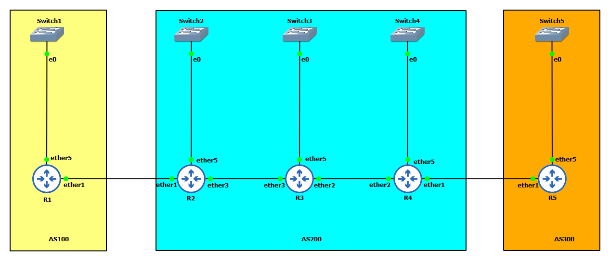

# README

<p>
    There are two projects in here<br>
    1. iBGP on MikroTik RouterOS v7 <br> 
    2. Route Reflector on MikroTik RouterOS v7<br>
</p>

## iBGP README

<p>
  GNS3 project dump file is included in this folder you can load this on your GNS3 to test it.<br>
  GNS3 version used is 2.2.29 <br>
  MikroTik CHR version used is 7.1.1 <br>
  Default username and password of MikroTik images is admin:1111
</p>
    
#### Note

<p>
- This configuration files have some extra configurations for Route Reflect, which will be used in the next video.<br>
- For Scenario 1 you can remove R3, and connect R2 and R4 directly over ether4 on both the sides<br>
</p>

### Configuration for R1
```
/interface bridge
add name=lo
/disk
set sata1 disabled=no
/interface wireless security-profiles
set [ find default=yes ] supplicant-identity=MikroTik
/port
set 0 name=serial0
/ip address
add address=192.168.1.1/24 interface=ether5 network=192.168.1.0
add address=10.1.1.1 interface=lo network=10.1.1.1
add address=172.16.12.1/30 interface=ether1 network=172.16.12.0
/ip dhcp-client
add interface=ether1
/ip firewall address-list
add address=192.168.1.0/24 list=bgpadvert
/routing bgp connection
add as=100 connect=yes listen=yes local.role=ebgp name=ro-R2 output.network=\
    bgpadvert remote.address=172.16.12.2 .as=200 router-id=10.1.1.1
/system identity
set name=R1
```
 
### Configuration for R2

```
/interface bridge
add name=lo
/interface ethernet
set [ find default-name=ether1 ] disable-running-check=no
set [ find default-name=ether2 ] disable-running-check=no
set [ find default-name=ether3 ] disable-running-check=no
set [ find default-name=ether4 ] disable-running-check=no
set [ find default-name=ether5 ] disable-running-check=no
/disk
set sata1 disabled=no
/interface wireless security-profiles
set [ find default=yes ] supplicant-identity=MikroTik
/port
set 0 name=serial0
/routing ospf instance
add name=instt_v2 router-id=10.2.2.2
/routing ospf area
add instance=instt_v2 name=backbone
/ip address
add address=10.2.2.2 interface=lo network=10.2.2.2
add address=172.16.12.2/30 interface=ether1 network=172.16.12.0
add address=172.16.23.1/30 interface=ether3 network=172.16.23.0
add address=192.168.2.1/24 disabled=yes interface=ether5 network=192.168.2.0
add address=172.16.24.1/30 interface=ether4 network=172.16.24.0
/ip dhcp-client
add interface=ether1
/ip firewall address-list
add address=192.168.2.0/24 list=bgpadvert
/routing bgp connection
add as=200 connect=yes disabled=no listen=yes local.role=ebgp name=to-R1 \
    nexthop-choice=default output.network=bgpadvert remote.address=\
    172.16.12.1 .as=100 router-id=10.2.2.2
add as=200 connect=yes disabled=no listen=yes local.role=ibgp-rr-client name=\
    to-R3 nexthop-choice=force-self output.network=bgpadvert remote.address=\
    172.16.23.2 .as=200 router-id=10.2.2.2
add as=200 connect=yes disabled=yes listen=yes local.role=ibgp name=to-R4 \
    nexthop-choice=force-self output.network=bgpadvert remote.address=\
    172.16.24.2 .as=200 router-id=10.2.2.2
add as=200 connect=yes listen=yes local.address=10.2.2.2 .role=ibgp multihop=\
    yes name=to-R4-multi nexthop-choice=force-self remote.address=10.4.4.4 \
    .as=200 router-id=10.2.2.2
/routing ospf interface-template
add area=backbone networks=172.16.23.0/30
add area=backbone networks=10.2.2.2
/system identity
set name=R2
```

### Configuration for R3

```
/interface bridge
add name=lo
/interface ethernet
set [ find default-name=ether1 ] disable-running-check=no
set [ find default-name=ether2 ] disable-running-check=no
set [ find default-name=ether3 ] disable-running-check=no
set [ find default-name=ether4 ] disable-running-check=no
set [ find default-name=ether5 ] disable-running-check=no
/disk
set sata1 disabled=no
/interface wireless security-profiles
set [ find default=yes ] supplicant-identity=MikroTik
/port
set 0 name=serial0
/routing ospf instance
add name=inst_v2 router-id=10.3.3.3
/routing ospf area
add instance=inst_v2 name=backbone
/ip address
add address=10.3.3.3 interface=lo network=10.3.3.3
add address=172.16.23.2/30 interface=ether3 network=172.16.23.0
add address=192.168.3.1/24 interface=ether5 network=192.168.3.0
add address=172.16.34.2/30 interface=ether2 network=172.16.34.0
/ip dhcp-client
add interface=ether1
/ip firewall address-list
add address=192.168.3.0/24 list=bgpadvert
/routing bgp connection
add as=200 connect=yes listen=yes local.role=ibgp-rr name=to-R2 \
    nexthop-choice=force-self output.network=bgpadvert remote.address=\
    172.16.23.1 .as=200 router-id=10.3.3.3
add as=200 connect=yes disabled=no listen=yes local.role=ibgp-rr name=to-R4 \
    nexthop-choice=force-self output.network=bgpadvert remote.address=\
    172.16.34.1 .as=200 router-id=10.3.3.3
/routing filter rule
add chain=to-R4 disabled=no rule=\
    "if (dst==192.168.2.0/24) {set gw 172.16.34.2; accept}"
add chain=to-R4 disabled=no rule=\
    "if (dst==192.168.1.0/24) {set gw 172.16.34.2; accept}"
add chain=to-R4 disabled=no rule=\
    "if (dst==192.168.3.0/24) {set gw 172.16.34.2; accept}"
add chain=to-R2 disabled=no rule=\
    "if (dst==192.168.4.0/24) {set gw 172.16.23.2; accept} "
add chain=to-R2 disabled=no rule=\
    "if (dst==192.168.5.0/24) {set gw 172.16.23.2; accept} "
add chain=to-R2 disabled=no rule=\
    "if (dst==192.168.3.0/24) {set gw 172.16.23.2; accept} "
/routing ospf interface-template
add area=backbone networks=172.16.23.0/30
add area=backbone networks=10.3.3.3
add area=backbone networks=172.16.34.0/30
/system identity
set name=R3
```

### Configuration for R4

```
/interface bridge
add name=lo
/interface ethernet
set [ find default-name=ether1 ] disable-running-check=no
set [ find default-name=ether2 ] disable-running-check=no
set [ find default-name=ether3 ] disable-running-check=no
set [ find default-name=ether4 ] disable-running-check=no
set [ find default-name=ether5 ] disable-running-check=no
/disk
set sata1 disabled=no
/interface wireless security-profiles
set [ find default=yes ] supplicant-identity=MikroTik
/port
set 0 name=serial0
/routing ospf instance
add name=inst_v2 router-id=10.4.4.4
/routing ospf area
add instance=inst_v2 name=backbone
/ip address
add address=10.4.4.4 interface=lo network=10.4.4.4
add address=172.16.34.1/30 interface=ether2 network=172.16.34.0
add address=192.168.4.1/24 interface=ether5 network=192.168.4.0
add address=172.16.45.1/30 interface=ether1 network=172.16.45.0
add address=172.16.24.2/30 interface=ether4 network=172.16.24.0
/ip dhcp-client
add interface=ether1
/ip firewall address-list
add address=192.168.4.0/24 list=bgpadvert
/routing bgp connection
add as=200 connect=yes disabled=no listen=yes local.role=ibgp-rr-client name=\
    to-R3 nexthop-choice=force-self output.network=bgpadvert remote.address=\
    172.16.34.2 .as=200
add as=200 connect=yes listen=yes local.role=ebgp name=to-R5 output.network=\
    bgpadvert remote.address=172.16.45.2 .as=300 router-id=10.4.4.4
add as=200 connect=yes disabled=yes listen=yes local.role=ibgp name=to-R2 \
    nexthop-choice=force-self output.network=bgpadvert remote.address=\
    172.16.24.1 .as=200 router-id=10.4.4.4
add as=200 connect=yes listen=yes local.address=10.4.4.4 .role=ibgp multihop=\
    yes name=to-R2-multi nexthop-choice=force-self remote.address=10.2.2.2 \
    .as=200 router-id=10.4.4.4
/routing ospf interface-template
add area=backbone networks=10.4.4.4
add area=backbone networks=172.16.34.0/30
/system identity
set name=R4
```

### Configuration for R5

```
/interface bridge
add name=lo
/interface ethernet
set [ find default-name=ether1 ] disable-running-check=no
set [ find default-name=ether2 ] disable-running-check=no
set [ find default-name=ether3 ] disable-running-check=no
set [ find default-name=ether4 ] disable-running-check=no
set [ find default-name=ether5 ] disable-running-check=no
/disk
set sata1 disabled=no
/interface wireless security-profiles
set [ find default=yes ] supplicant-identity=MikroTik
/port
set 0 name=serial0
/ip address
add address=10.5.5.5 interface=lo network=192.168.5.5
add address=192.168.5.1/24 interface=ether5 network=192.168.5.0
add address=172.16.45.2/30 interface=ether1 network=172.16.45.0
/ip dhcp-client
add interface=ether1
/ip firewall address-list
add address=192.168.5.0/24 list=bgpadvert
/routing bgp connection
add as=300 connect=yes disabled=no listen=yes local.role=ebgp name=to-R4 \
    output.network=bgpadvert remote.address=172.16.45.1 .as=200
/system identity
set name=R5
```


## Route Reflector ReadMe

<p>
  GNS3 project dump file is included in this folder you can load this on your GNS3 to test it.<br>
  GNS3 version used is 2.2.29 <br>
  MikroTik CHR version used is 7.1.1 <br>
  Default username and password of MikroTik images is admin:1111
</p>



### R1 Configuration

```
/interface bridge
add name=loopback
/interface ethernet
set [ find default-name=ether1 ] disable-running-check=no
set [ find default-name=ether2 ] disable-running-check=no
set [ find default-name=ether3 ] disable-running-check=no
set [ find default-name=ether4 ] disable-running-check=no
set [ find default-name=ether5 ] disable-running-check=no
/disk
set sata1 disabled=no
/interface wireless security-profiles
set [ find default=yes ] supplicant-identity=MikroTik
/port
set 0 name=serial0
/ip address
add address=172.16.1.1 interface=loopback network=172.16.1.1
add address=192.168.1.1/24 interface=ether5 network=192.168.1.0
add address=10.12.1.1/30 interface=ether1 network=10.12.1.0
/ip dhcp-client
add interface=ether1
/ip firewall address-list
add address=192.168.1.0/24 list=bgpadvert
/routing bgp connection
add as=100 connect=yes listen=yes local.role=ebgp name=to-R2 output.network=\
    bgpadvert remote.address=10.12.1.2 .as=200 router-id=172.16.1.1
/system identity
set name=R1
```

### R2 Configuration

```
/interface bridge
add name=loopback
/interface ethernet
set [ find default-name=ether1 ] disable-running-check=no
set [ find default-name=ether2 ] disable-running-check=no
set [ find default-name=ether3 ] disable-running-check=no
set [ find default-name=ether4 ] disable-running-check=no
set [ find default-name=ether5 ] disable-running-check=no
/disk
set sata1 disabled=no
/interface wireless security-profiles
set [ find default=yes ] supplicant-identity=MikroTik
/port
set 0 name=serial0
/ip address
add address=172.16.2.2 interface=loopback network=172.16.2.2
add address=192.168.2.1/24 interface=ether5 network=192.168.2.0
add address=10.12.1.2/30 interface=ether1 network=10.12.1.0
add address=10.23.1.2/30 interface=ether3 network=10.23.1.0
/ip dhcp-client
add interface=ether1
/ip firewall address-list
add address=192.168.2.0/24 list=bgpadvert
/routing bgp connection
add as=200 connect=yes listen=yes local.role=ebgp name=to-R1 output.network=\
    bgpadvert remote.address=10.12.1.1 .as=100 router-id=172.16.2.2
add as=200 connect=yes listen=yes local.role=ibgp-rr-client name=to-R3 \
    nexthop-choice=force-self output.network=bgpadvert remote.address=\
    10.23.1.1 .as=200 router-id=172.16.2.2
/system identity
set name=R2
```

### R3 Configuration

```
/interface bridge
add name=loopback
/interface ethernet
set [ find default-name=ether1 ] disable-running-check=no
set [ find default-name=ether2 ] disable-running-check=no
set [ find default-name=ether3 ] disable-running-check=no
set [ find default-name=ether4 ] disable-running-check=no
set [ find default-name=ether5 ] disable-running-check=no
/disk
set sata1 disabled=no
/interface wireless security-profiles
set [ find default=yes ] supplicant-identity=MikroTik
/port
set 0 name=serial0
/ip address
add address=172.16.3.3 interface=loopback network=172.16.3.3
add address=192.168.3.1/24 interface=ether5 network=192.168.3.0
add address=10.34.1.1/30 interface=ether2 network=10.34.1.0
add address=10.23.1.1/30 interface=ether3 network=10.23.1.0
/ip dhcp-client
add interface=ether1
/ip firewall address-list
add address=192.168.3.0/24 list=bgpadvert
/routing bgp connection
add as=200 connect=yes listen=yes local.role=ibgp-rr name=to-R4 \
    nexthop-choice=force-self output.filter-chain=to-R4 .network=bgpadvert \
    remote.address=10.34.1.2 .as=200 router-id=172.16.3.3
add as=200 connect=yes listen=yes local.role=ibgp-rr name=to-R2 \
    nexthop-choice=force-self output.filter-chain=to-R2 .network=bgpadvert \
    remote.address=10.23.1.2 .as=200 router-id=172.16.3.3
/routing filter rule
add chain=to-R4 disabled=no rule=\
    "if (dst==192.168.2.0/24) {set gw 10.34.1.1; accept}"
add chain=to-R4 disabled=no rule=\
    "if (dst==192.168.1.0/24) {set gw 10.34.1.1; accept}"
add chain=to-R4 disabled=no rule=\
    "if (dst==192.168.3.0/24) {set gw 10.34.1.1; accept}"
add chain=to-R2 disabled=no rule=\
    "if (dst==192.168.3.0/24) {set gw 10.23.1.1; accept}"
add chain=to-R2 disabled=no rule=\
    "if (dst==192.168.4.0/24) {set gw 10.23.1.1; accept}"
add chain=to-R2 disabled=no rule=\
    "if (dst==192.168.5.0/24) {set gw 10.23.1.1; accept}"
/system identity
set name=R3
```

### R4 Configuration

```
/interface bridge
add name=loopback
/interface ethernet
set [ find default-name=ether1 ] disable-running-check=no
set [ find default-name=ether2 ] disable-running-check=no
set [ find default-name=ether3 ] disable-running-check=no
set [ find default-name=ether4 ] disable-running-check=no
set [ find default-name=ether5 ] disable-running-check=no
/disk
set sata1 disabled=no
/interface wireless security-profiles
set [ find default=yes ] supplicant-identity=MikroTik
/port
set 0 name=serial0
/ip address
add address=172.16.4.4 interface=loopback network=172.16.4.4
add address=192.168.4.1/24 interface=ether5 network=192.168.4.0
add address=10.34.1.2/30 interface=ether2 network=10.34.1.0
add address=10.45.1.2/30 interface=ether1 network=10.45.1.0
/ip dhcp-client
add interface=ether1
/ip firewall address-list
add address=192.168.4.0/24 list=bgpadvert
/routing bgp connection
add as=200 connect=yes listen=yes local.role=ebgp name=to-R5 output.network=\
    bgpadvert remote.address=10.45.1.1 .as=300 router-id=172.16.4.4
add as=200 connect=yes listen=yes local.role=ibgp-rr-client name=to-R3 \
    nexthop-choice=force-self output.network=bgpadvert remote.address=\
    10.34.1.1 .as=200 router-id=172.16.4.4
/system identity
set name=R4
```

### R5 Configuration

```
/interface bridge
add name=loopback
/interface ethernet
set [ find default-name=ether1 ] disable-running-check=no
set [ find default-name=ether2 ] disable-running-check=no
set [ find default-name=ether3 ] disable-running-check=no
set [ find default-name=ether4 ] disable-running-check=no
set [ find default-name=ether5 ] disable-running-check=no
/disk
set sata1 disabled=no
/interface wireless security-profiles
set [ find default=yes ] supplicant-identity=MikroTik
/port
set 0 name=serial0
/ip address
add address=172.16.5.5 interface=loopback network=172.16.5.5
add address=192.168.5.1/24 interface=ether5 network=192.168.5.0
add address=10.45.1.1/30 interface=ether1 network=10.45.1.0
/ip dhcp-client
add interface=ether1
/ip firewall address-list
add address=192.168.5.0/24 list=bgpadvert
/routing bgp connection
add as=300 connect=yes listen=yes local.role=ebgp name=to-R4 output.network=\
    bgpadvert remote.address=10.45.1.2 .as=200 router-id=172.16.5.5
/system identity
set name=R5
```