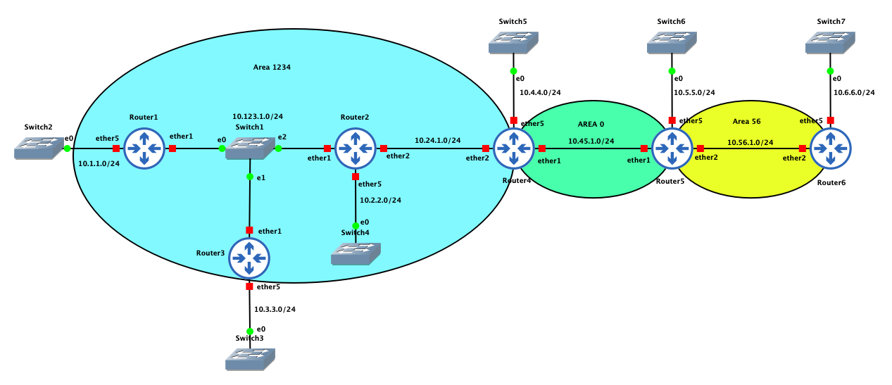

# README

This repository for MikroTik OSPF live training on 17/12/2021</br>
GNS3 v2.2.24</br>
RouterOS v6.45.8 </br>
Network Diagram is attached. gns3project file is attached. The attached file has all the IP addresses on the Routers configured.




### Router-1
```
/interface bridge
add name=lo0
/interface ethernet
set [ find default-name=ether1 ] disable-running-check=no
set [ find default-name=ether2 ] disable-running-check=no
set [ find default-name=ether3 ] disable-running-check=no
set [ find default-name=ether4 ] disable-running-check=no
set [ find default-name=ether5 ] disable-running-check=no
/interface wireless security-profiles
set [ find default=yes ] supplicant-identity=MikroTik
/ip address
add address=192.168.1.1 interface=lo0 network=192.168.1.1
add address=10.1.1.1/24 interface=ether5 network=10.1.1.0
add address=10.123.1.1/24 interface=ether1 network=10.123.1.0
/ip dhcp-client
add dhcp-options=hostname,clientid disabled=no interface=ether1
/system identity
set name=R1

```

### Router-2
```
/interface bridge
add name=lo0
/interface ethernet
set [ find default-name=ether1 ] disable-running-check=no
set [ find default-name=ether2 ] disable-running-check=no
set [ find default-name=ether3 ] disable-running-check=no
set [ find default-name=ether4 ] disable-running-check=no
set [ find default-name=ether5 ] disable-running-check=no
/interface wireless security-profiles
set [ find default=yes ] supplicant-identity=MikroTik
/ip address
add address=192.168.2.2 interface=lo0 network=192.168.2.2
add address=10.123.1.2/24 interface=ether1 network=10.123.1.0
add address=10.2.2.1/24 interface=ether5 network=10.2.2.0
add address=10.24.1.2/24 interface=ether2 network=10.24.1.0
/ip dhcp-client
add dhcp-options=hostname,clientid disabled=no interface=ether1
/system identity
set name=R2

```

### Router-3
```
/interface bridge
add name=lo0
/interface ethernet
set [ find default-name=ether1 ] disable-running-check=no
set [ find default-name=ether2 ] disable-running-check=no
set [ find default-name=ether3 ] disable-running-check=no
set [ find default-name=ether4 ] disable-running-check=no
set [ find default-name=ether5 ] disable-running-check=no
/interface wireless security-profiles
set [ find default=yes ] supplicant-identity=MikroTik
/ip address
add address=192.168.3.3 interface=lo0 network=192.168.3.3
add address=10.3.3.1/24 interface=ether5 network=10.3.3.0
add address=10.123.1.3/24 interface=ether1 network=10.123.1.0
/ip dhcp-client
add dhcp-options=hostname,clientid disabled=no interface=ether1
/system identity
set name=R3

```
### Router-4
```
/interface bridge
add name=lo0
/interface ethernet
set [ find default-name=ether1 ] disable-running-check=no
set [ find default-name=ether2 ] disable-running-check=no
set [ find default-name=ether3 ] disable-running-check=no
set [ find default-name=ether4 ] disable-running-check=no
set [ find default-name=ether5 ] disable-running-check=no
/interface wireless security-profiles
set [ find default=yes ] supplicant-identity=MikroTik
/ip address
add address=192.168.4.4 interface=lo0 network=192.168.4.4
add address=10.4.4.1/24 interface=ether5 network=10.4.4.0
add address=10.24.1.4/24 interface=ether2 network=10.24.1.0
add address=10.45.1.4/24 interface=ether1 network=10.45.1.0
/ip dhcp-client
add dhcp-options=hostname,clientid disabled=no interface=ether1
/system identity
set name=R4
```
### Router-5
```
/interface bridge
add name=lo0
/interface ethernet
set [ find default-name=ether1 ] disable-running-check=no
set [ find default-name=ether2 ] disable-running-check=no
set [ find default-name=ether3 ] disable-running-check=no
set [ find default-name=ether4 ] disable-running-check=no
set [ find default-name=ether5 ] disable-running-check=no
/interface wireless security-profiles
set [ find default=yes ] supplicant-identity=MikroTik
/ip address
add address=192.168.5.5 interface=lo0 network=192.168.5.5
add address=10.5.5.1/24 interface=ether5 network=10.5.5.0
add address=10.45.1.5/24 interface=ether1 network=10.45.1.0
add address=10.56.1.5/24 interface=ether2 network=10.56.1.0
/ip dhcp-client
add dhcp-options=hostname,clientid disabled=no interface=ether1
/system identity
set name=R5

```
### Router-6
```
/interface bridge
add name=lo0
/interface ethernet
set [ find default-name=ether1 ] disable-running-check=no
set [ find default-name=ether2 ] disable-running-check=no
set [ find default-name=ether3 ] disable-running-check=no
set [ find default-name=ether4 ] disable-running-check=no
set [ find default-name=ether5 ] disable-running-check=no
/interface wireless security-profiles
set [ find default=yes ] supplicant-identity=MikroTik
/ip address
add address=192.168.6.6 interface=lo0 network=192.168.6.6
add address=10.6.6.1/24 interface=ether5 network=10.6.6.0
add address=10.56.1.6/24 interface=ether2 network=10.56.1.0
/ip dhcp-client
add dhcp-options=hostname,clientid disabled=no interface=ether1
/system identity
set name=R6

```
